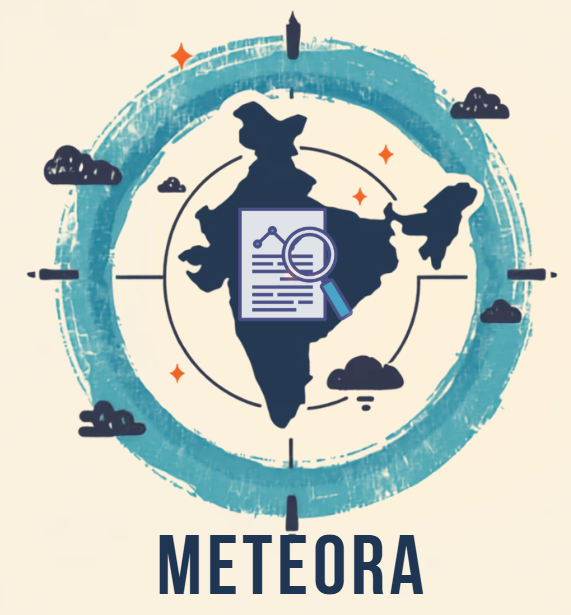

# METEORA: National Weather Big Data Analytics Platform

  

  <b>Real-Time Weather Incident Fusion, NLP Correlation, and Evidence-Based Verification Engine</b>

---

## Overview

**METEORA** is a national weather intelligence platform built for the Smart India Hackathon (SIH) IMD problem statement. Unlike standard forecasting apps, **METEORA** aggregates raw unstructured reports from social media OSINT, news RSS feeds, satellite observations, and ground operators, using NLP and spatial-temporal correlation to turn raw data into verified, actionable incident intelligence.

