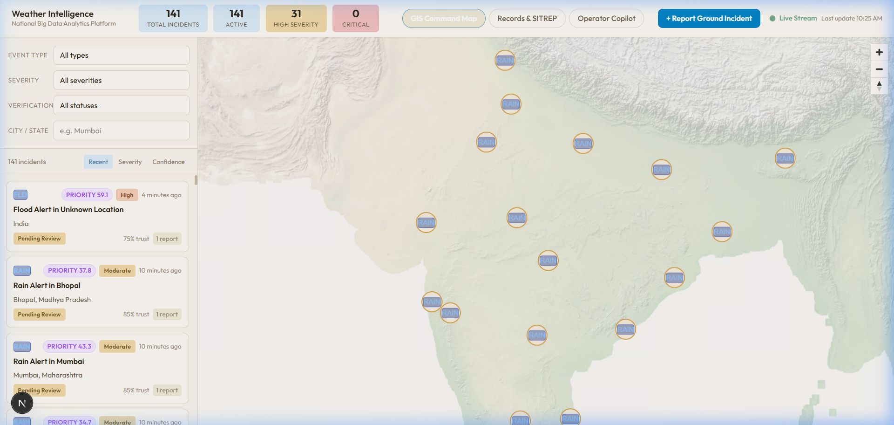
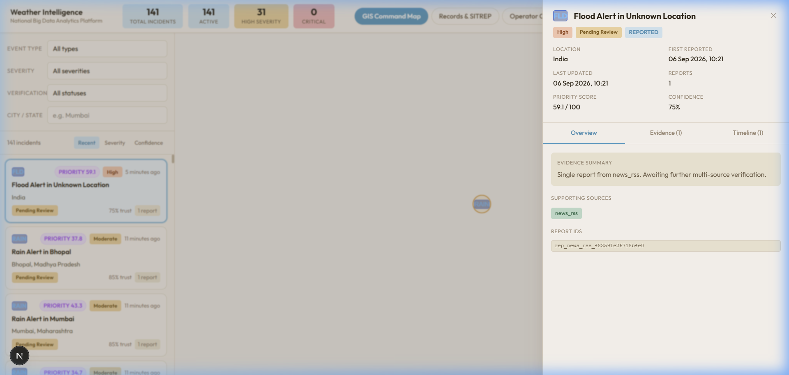
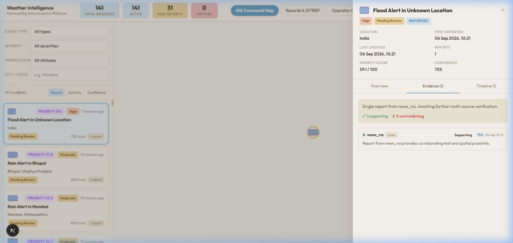
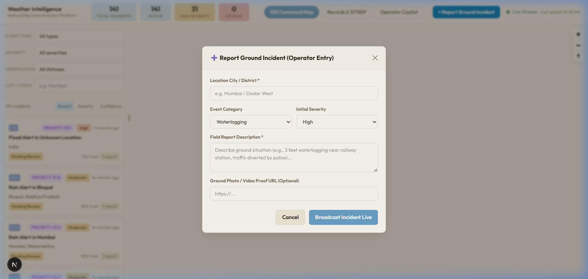
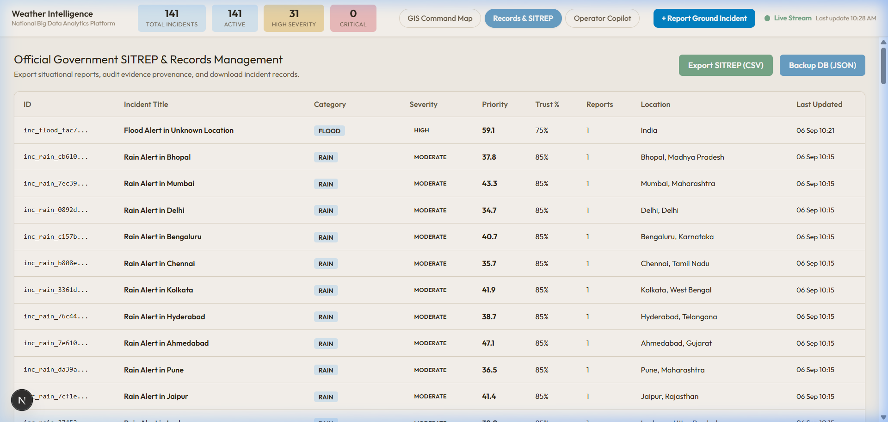
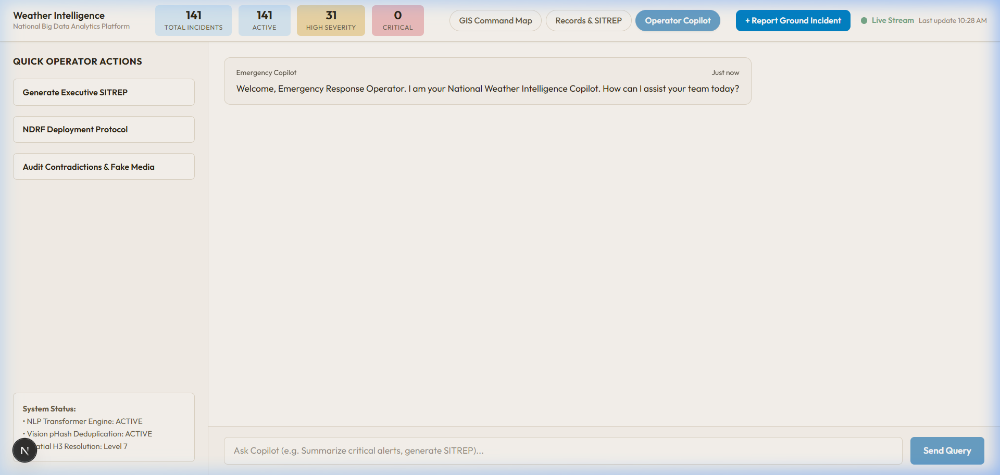
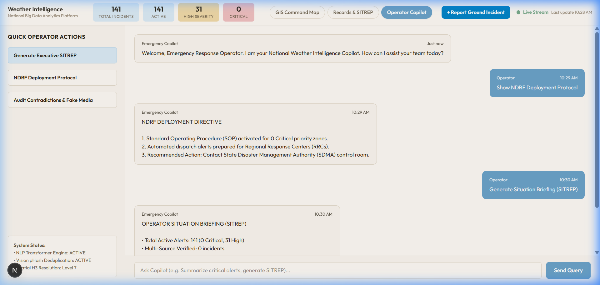

# National Weather Intelligence Platform — Visual Feature Showcase

This directory contains high-resolution visual documentation and feature walkthrough screenshots of the **National Weather Big Data Analytics Platform**, designed specifically for disaster management control rooms (NDRF, SDMA, IMD).

---

## Screenshot Gallery & Feature Reference

### 1. GIS Command Map Overview

* **Filename:** [`01_gis_command_map.png`](01_gis_command_map.png)
* **Feature:** Tactical Incident Command Center & Live Map
* **Description:** Displays interactive MapLibre GIS mapping overlaid with active weather incidents across India. Highlights real-time severity metrics (Critical, High, Moderate), live WebSocket connection status, category filters, and prioritized incident cards sorted by dynamic urgency.

---

### 2. Incident Detail & Provenance Panel

* **Filename:** [`02_evidence_detail_panel.png`](02_evidence_detail_panel.png)
* **Feature:** Incident Inspection & Provenance Drawer
* **Description:** Opening an incident reveals a detailed tactical drawer showing exact GPS coordinates, priority scores (e.g. `59.1 / 100`), overall confidence percentages (`85%`), supporting data sources, and underlying report IDs.

---

### 3. Multi-Source Evidence & Confidence Scoring

* **Filename:** [`03_multi_source_evidence.png`](03_multi_source_evidence.png)
* **Feature:** Multi-Modal Evidence Calibration
* **Description:** Breaks down raw report evidence by source reliability (Official IMD = 0.95, News RSS = 0.70, Social OSINT = 0.40). Shows extracted location parameters, media proof links, and relationship classifications (`SUPPORTED`, `CONTRADICTED`, `UNVERIFIED`).

---

### 4. Field Operator Ground Incident Entry

* **Filename:** [`04_live_ground_report_modal.png`](04_live_ground_report_modal.png)
* **Feature:** Real-Time Field Incident Submission
* **Description:** Modal form allowing ground response operators to submit real-time field observations. Submissions trigger immediate NLP correlation via FastAPI and broadcast updates to all connected dashboards over Redis Streams & WebSockets without page reload.

---

### 5. Government SITREP & Records Management

* **Filename:** [`05_records_sitrep_management.png`](05_records_sitrep_management.png)
* **Feature:** Official Compliance & Data Export
* **Description:** Tabular SITREP manager compiling active disaster records. Includes 1-click **Export SITREP (CSV)** for Ministry of Home Affairs (MHA) reporting and **Backup DB (JSON)** for offline database audit trails.

---

### 6. Emergency Response Copilot Assistant

* **Filename:** [`06_operator_copilot_assistant.png`](06_operator_copilot_assistant.png)
* **Feature:** AI Operator Copilot Interface
* **Description:** Tactical chat interface connecting operators to the FastAPI `POST /api/v1/incidents/copilot` endpoint. Displays quick action presets (Executive SITREP, NDRF SOPs, Fake Media Audits) and real-time NLP/Vision engine status indicators.

---

### 7. Automated Executive SITREP Generation

* **Filename:** [`07_copilot_sitrep_generation.png`](07_copilot_sitrep_generation.png)
* **Feature:** Copilot Intelligence Synthesis
* **Description:** Demonstrates the Copilot generating an instant Executive Situation Briefing directly from live PostgreSQL database records, summarizing total active alerts, critical priority targets, and multi-source verification ratios.
