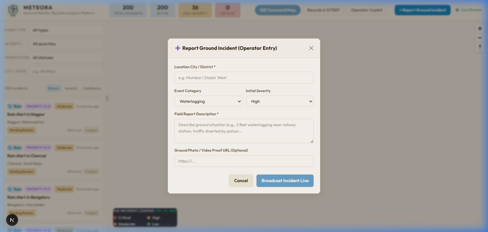
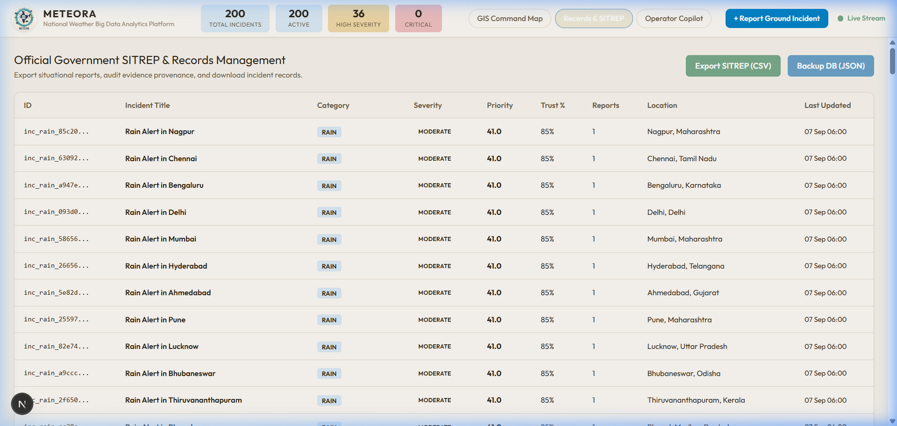
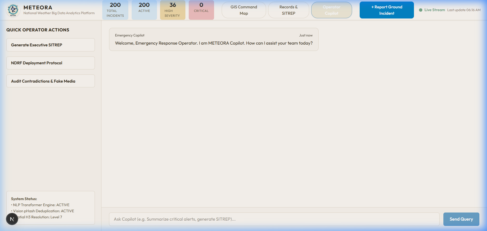
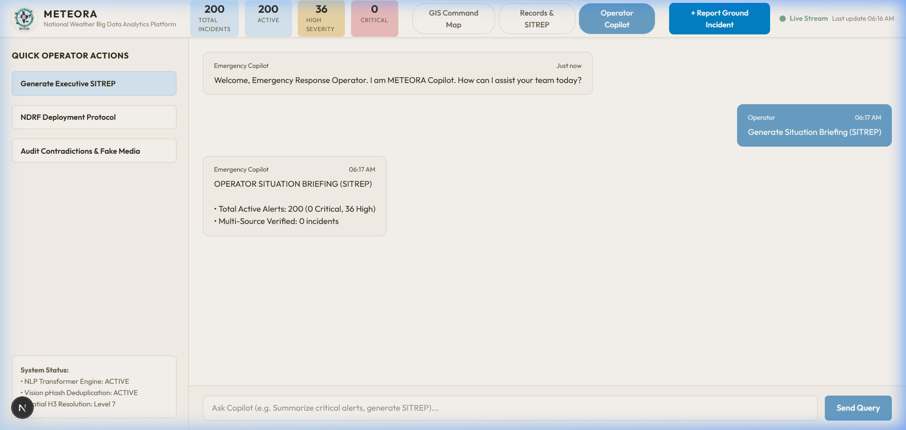

# System Showcase & Differentiators

This gallery documents the live operational features and core differentiators of the **METEORA National Weather Big Data Analytics Platform**, captured directly from the live environment.

---

### 1. GIS Command Center Map & Live Incident Stream
> **Differentiator**: National H3 spatial indexing, dynamic priority scoring, clean SVG weather category badges, and location pin callout labels.

---

### 2. Multi-Source Evidence & Verification Panel
> **Differentiator**: Never labels rumors as simple true/fake. Displays source trust weighting (IMD: 0.95, News: 0.70, Citizen: 0.45), supporting vs contradicting reports, and media proof URLs.

---

### 3. Live Ground Report Entry & Media Submission
> **Differentiator**: Direct field observation ingestion capturing location, category, severity, and photo/video proof URLs for instant WebSocket map propagation.

---

### 4. Records Management & 1-Click SITREP Export
> **Differentiator**: Structured incident logs with automated government Situation Report (SITREP) CSV export formatted for NDRF / MoES / MHA inter-agency transmission.

---

### 5. Operator Copilot Assistant Interface
> **Differentiator**: AI decision-support assistant with preset operational workflows for Executive Briefings, NDRF Deployment Protocols, and Contradiction Audits.

---

### 6. Automated Executive SITREP Briefing Generation
> **Differentiator**: Instantly aggregates top-priority PostgreSQL alerts, severity metrics, and verification rates into formatted operational directives.

